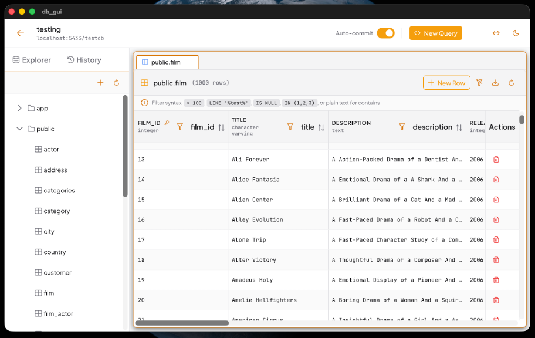

# DB GUI

Lekkie, wieloplatformowe narzędzie do zarządzania relacyjnymi bazami danych, zbudowane z wykorzystaniem frameworka [Tauri](https://tauri.app/), języka [Rust](https://www.rust-lang.org/) oraz [Vue.js 3](https://vuejs.org/).



## Funkcjonalności

- **Obsługa wielu silników bazodanowych**: PostgreSQL, MySQL, SQLite
- **Edytor SQL**: Kolorowanie składni, autouzupełnianie (Monaco Editor)
- **Interaktywna siatka danych**: Sortowanie, filtrowanie, edycja inline
- **Zarządzanie transakcjami**: Tryb auto-commit oraz manualny (COMMIT/ROLLBACK)
- **Bezpieczne przechowywanie haseł**: Szyfrowanie z użyciem Tauri Stronghold
- **Eksport danych**: CSV, JSON
- **Tryb ciemny/jasny**: Automatyczne wykrywanie preferencji systemowych

## Wymagania systemowe

| System | Wymagania |
|--------|-----------|
| Windows | Windows 10/11 (x64), WebView2 Runtime |
| macOS | macOS 11+ (Intel/Apple Silicon) |
| Linux | glibc 2.31+, WebKitGTK 4.1 |

## Instalacja

### Gotowe pakiety

Pobierz najnowszą wersję z sekcji [Releases](https://github.com/janrudowski/db-gui/releases):

- **Windows**: `db-gui_x.x.x_x64-setup.exe`
- **macOS**: `db-gui_x.x.x_aarch64.dmg` (Apple Silicon) lub `db-gui_x.x.x_x64.dmg` (Intel)
- **Linux**: `db-gui_x.x.x_amd64.AppImage` lub `db-gui_x.x.x_amd64.deb`

### Budowanie ze źródeł

#### Wymagania

- [Node.js](https://nodejs.org/) 18+
- [pnpm](https://pnpm.io/)
- [Rust](https://rustup.rs/) 1.70+

#### Kroki

```bash
git clone https://github.com/janrudowski/db-gui.git
cd db-gui

pnpm install

pnpm tauri dev

pnpm tauri build
```

## Struktura projektu

```
db-gui/
├── src/                    # Frontend (Vue.js + TypeScript)
│   ├── components/         # Komponenty Vue
│   ├── stores/             # Magazyny stanu Pinia
│   └── views/              # Główne widoki
├── src-tauri/              # Backend (Rust)
│   └── src/
│       ├── db/             # Abstrakcje baz danych
│       └── commands.rs     # Komendy Tauri (IPC)
└── tests/                  # Testy automatyczne
```

## Rozwój

### Uruchomienie testów

```bash
pnpm test

cd src-tauri && cargo test
```

### Konfiguracja IDE

Zalecane rozszerzenia VS Code:
- [rust-analyzer](https://marketplace.visualstudio.com/items?itemName=rust-lang.rust-analyzer)
- [Volar](https://marketplace.visualstudio.com/items?itemName=Vue.volar)
- [Tauri](https://marketplace.visualstudio.com/items?itemName=tauri-apps.tauri-vscode)

## Licencja

[MIT](LICENSE)

## Autor

Jan Rudowski - Praca inżynierska, Uniwersytet WSB Merito w Poznaniu, 2025
